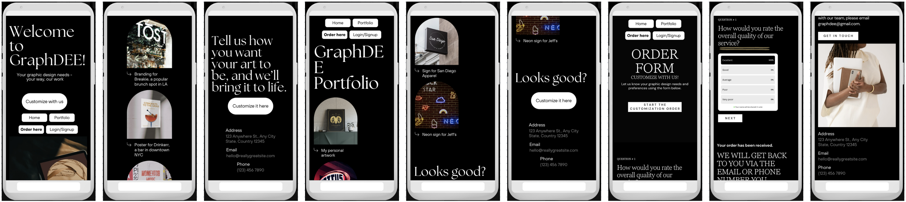
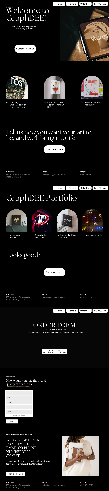

# graphDee — A Freelance Graphic Design Store

## Project Overview
**graphDee** is a simple full-stack web app where customers can purchase custom graphic design work. Visitors can browse a showcase gallery; registered users can place an order, see a live price preview (JS), pay in Stripe test mode, and track orders. Staff can upload completed work for the customer to download.

This project satisfies typical Django full-stack requirements: multiple apps, relational models, authentication, forms with validation, Stripe payments, JavaScript UX, version control, documentation, and (optional) deployment.

---

## Purpose

### Business Goals
- Let customers place and pay for design orders easily.
- Showcase past work and testimonials to build trust.
- Provide a simple internal flow for fulfilling and delivering designs.
- Deploy when the MVP is stable to enable demos and feedback.

### Target Users
- **Prospective customers** evaluating design quality and pricing.
- **Paying users** who need custom graphics (logo, poster, icon).
- **Site owner (designer)** delivering files and managing orders.

### User Needs
- Clear gallery of previous work and results.
- Simple order form with a predictable pricing model.
- Secure, familiar checkout (Stripe test mode).
- A dashboard to see order status and download results.
- For the designer: easy upload/delivery and basic admin tools.

---

## User Stories Overview
1. **Authentication**: As a user, I can sign up, log in, and log out to access ordering and my dashboard.
2. **Gallery**: As a visitor, I can browse previous work and testimonials to decide to buy.
3. **Order & Pay**: As a logged-in user, I can place an order, preview price (JS), and pay (server-verified price via Stripe).
4. **Delivery**: As staff, I can upload finished designs and mark orders as completed; as a customer, I can download.
5. *(Stretch)* **Feedback**: As a customer, I can accept results or request changes and submit a testimonial that appears in the gallery.

---

## Website Structure

### Menu
- **Home** (`/`) — Gallery and landing CTA.
- **Order** (`/orders/`) — Order form + Stripe checkout.
- **My Orders** (`/orders/my/`) — Past orders, statuses, downloads.
- **Login/Signup/Logout** — Allauth routes under `/accounts/`.
- **Admin** (`/admin/`) — Django admin for staff.

### Wireframes
- 
- 
- 


## Features
### Authentication via `django-allauth` (email or username).
- Users can register, log in, and log out
- Only logged-in users can create and manage orders
### Gallery of previous designs with optional testimonial text.
- Order form with server-validated pricing and client-side preview.
### Payments
- Stripe Checkout (test mode) with server-calculated price.
- Stripe integration (test mode) for secure payments
- Orders marked as paid after successful checkout
### My Orders (Full CRUD) page for users (see history, status, download result).
- Create: Users submit a new order via the order form
- Read: Users can view all their orders on the "My Orders" page
- Update: Users can edit order details (type, size, description, file)
- Delete: Users can delete orders via a confirmation page
- Upload and download design files
- Access control is enforced so users can only view and modify their own orders.
- **Admin delivery**: staff uploads completed files and marks status.
- **Static/Media handling** with WhiteNoise (static) and Django media.

All CRUD operations are implemented on the Order model, allowing users to fully manage their data through the frontend.

Access control ensures users can only view, edit, and delete their own orders.

## Data Model

### Order Model
- user (ForeignKey to User)
- type (logo, poster, icon)
- size (S, M, L)
- description (text)
- design_file (file upload)
- price (decimal)
- paid (boolean)
- status (text)

### Gallery Model
- title
- image
- description
- testimonial (optional)


### Relationships
- Each Order is linked to a single User
- Each user can have multiple orders 

Also see TESTING.md

---

## Technologies Used

#### Languages Used
- HTML  
- CSS  
- JavaScript
- Python

#### Frameworks, Libraries & Programs Used
- VS Code for local development https://code.visualstudio.com/
- Github for saving and storing files, and version control https://github.com/
- Canva for images and wireframes https://www.canva.com/
- Preview Editor app in MacBook for editing photos https://preview.app/login
- IMAGECOLORPICKER.com to choose color palette https://imagecolorpicker.com/
- Squoosh for converting image file types from png/jpg to. webp https://squoosh.app/
- Google Fonts for typography https://fonts.google.com/
- Font Awesome for icons https://fontawesome.com/
- Favicon.io for generation of favicons https://favicon.io/
- Bootstrap for styling/layout https://getbootstrap.com/
- Autoprefixer for CSS versatility https://autoprefixer.github.io/
- The W3C CSS Validation Service to review codes https://www.w3.org/
- Nu Html Checker to review codes https://validator.nu/
- WebAIM: Contrast Checker to verify contrast for color palette https://webaim.org/resources/contrastchecker/

- **Python**  
- Custom Python logic to calculate order pricing dynamically based on type and size
- Additional logic is to handle files during updates.
```python
def server_price(type_, size):
    base = {"logo": 30, "poster": 40, "icon": 20}[type_]
    mult = {"S": 1.0, "M": 1.5, "L": 2.0}[size]
    return Decimal(base * mult).quantize(Decimal("0.01"))
```

Additional Python logic is used to process uploaded file names and remove automatically generated suffixes, improving user experience and demonstrating string manipulation using regular expressions.
```python
if not request.FILES.get('design_file'):
                # No new file uploaded → keep old file
                updated_order.design_file = original_file
```
Additional Python logic is used to check payment status
```python
if session.get("payment_status") == "paid":
```

- **Django** 
- **django-allauth** 
- **Stripe** (Checkout Sessions, SDK)
- **SQLite** (dev)
- **PostgreSQL** in production via `psycopg2-binary`
- **Gunicorn**, **WhiteNoise**
- **Pillow**
- **Bootstrap 5**
- Minimal custom **JavaScript** (price preview)
- **Git & GitHub**
- **Heroku**
- **AWS S3**

### Deployment & Local Development
Github Repo: https://github.com/limcaroline/graphdee

##### Heroku Deployment
This project is deployed using Heroku with a PostgreSQL database.

Prerequisites
A Heroku account
A GitHub repository
A Stripe account (for payments)

Steps to Deploy
Create Heroku App
Go to the Heroku Dashboard
Click "New" → "Create new app"
Choose a unique app name

Connect GitHub Repository
Go to the Deploy tab
Select GitHub
Connect your repository
Enable automatic deploys (optional)

Set Environment Variables (Config Vars)
In Heroku → Settings → Config Vars, add:
SECRET_KEY=your_secret_key
DEBUG=False
ALLOWED_HOSTS=graphdee-production-app-5fefb210336f.herokuapp.com
CSRF_TRUSTED_ORIGINS=https://graphdee-production-app-5fefb210336f.herokuapp.com

DATABASE_URL=your_postgres_url

STRIPE_PUBLIC_KEY=your_key
STRIPE_SECRET_KEY=your_key
STRIPE_WEBHOOK_SECRET=your_key

USE_AWS=True
AWS_STORAGE_BUCKET_NAME=your_bucket
AWS_S3_REGION_NAME=your_region

Database Setup
Heroku automatically provisions PostgreSQL.

Run migrations:
python manage.py migrate

Collect static files
python manage.py collectstatic --noinput

Create Superuser
python manage.py createsuperuser

Deploy Application
Push to GitHub:
git push origin main

Then deploy via Heroku dashboard or
git push heroku main in VSCode

Test Deployment
Visit your live URL and test:

User registration and login
Order creation
Order editing and deletion
File upload and download
Stripe payment flow

Running Locally
Clone repository:
git clone https://github.com/limcaroline/graphdee.git

cd graphdee

Create virtual environment:
python3 -m venv venv
source venv/bin/activate

Install dependencies:
pip install -r requirements.txt

Set environment variables:
export DEVELOPMENT=True
export SECRET_KEY=your_secret_key

Run migrations:
python manage.py migrate

Run server:
python manage.py runserver

Sensitive data such as API keys and secret keys are stored in environment variables and are not included in the repository for security reasons.

### Version Control
The project is stored in a GitHub repository https://github.com/limcaroline/graphdee and version controlled using Git.  
Changes are committed locally and pushed to GitHub, which is connected to Heroku for deployment.

#### How to Fork
In Github, go to this Repository: https://github.com/limcaroline/graphdee
Click the Fork button at the top right of this page to create your own copy of the repo.

#### How to Clone
In Github, go to this Repository: https://github.com/limcaroline/graphdee
Click the green Code button.
Copy the URL under "HTTPS".
Open your terminal.
Run this command: git clone https://github.com/limcaroline/graphdee


---


### Testing
See TESTING.md 


### Future Enhancements
More detailed pricing options (colors, turnaround, vector source).
Change Requests: a one-click “Request changes” status (single revision round).
Accept + Testimonial: save testimonial and auto-add final image to Gallery.

### Credits

Django — https://www.djangoproject.com/

django-allauth — https://django-allauth.readthedocs.io/

Stripe — https://stripe.com/

Bootstrap — https://getbootstrap.com/

WhiteNoise — https://whitenoise.evans.io/

Pillow — https://python-pillow.org/


Media

See also Frameworks, Libraries & Programs Used for more references
Canva for images
Bootstrap Version 5.3 for styling/layout
Google Fonts for typography
Font Awesome for icons
Favicon.io

Bootstrap for cards and similar, also see comments in VSCode https://getbootstrap.com/
Code Institute's modules https://learn.codeinstitute.net/dashboard
ChatGPT for helping with ideas, debugging, and structuring https://chatgpt.com/
Autoprefixer for code prefix on transition
Discord for references and examples
Django documentation https://docs.djangoproject.com/en/5.2/
w3schools for python tutorials and materials https://www.w3schools.com/
learnpython.org for python tutorials and materials https://www.learnpython.org/

Acknowledgments

Big thanks to Code Institute’s team as well as materials and Level 5 Diploma in Web Application Development modules and walkthrough projects, which I have used as references!
Special thanks to ChatGPT by OpenAI and Claude Code by Anthropic for assistance in troubleshooting and debugging, as well as support in ideas and structure.
Thank you to all the mentioned in this readme and in VScode that was helpful in making this project!