# GraphDee – Testing

---

**Contents**
- [GraphDee – Testing](#graphdee--testing)
  - [Responsiveness](#responsiveness)
    - [Mobile Screenshots](#mobile-screenshots)
    - [Tablet Screenshots](#tablet-screenshots)
    - [Desktop Screenshots](#desktop-screenshots)
  - [Validations](#validations)
    - [W3C Validator](#w3c-validator)
    - [JSHint](#jshint)
    - [Python Linter](#python-linter)
  - [Lighthouse](#lighthouse)
  - [Wave](#wave)
  - [Browser Compatibility](#browser-compatibility)
  - [Full Testing](#full-testing)
    - [Interactive Elements](#interactive-elements)
  - [Bugs](#bugs)
    - [Solved Bugs](#solved-bugs)
    - [Known Bugs](#known-bugs)

---

## Responsiveness

GraphDee was tested across a range of viewport sizes using Chrome DevTools device toolbar to ensure a consistent experience from mobile to desktop.

### Mobile Screenshots
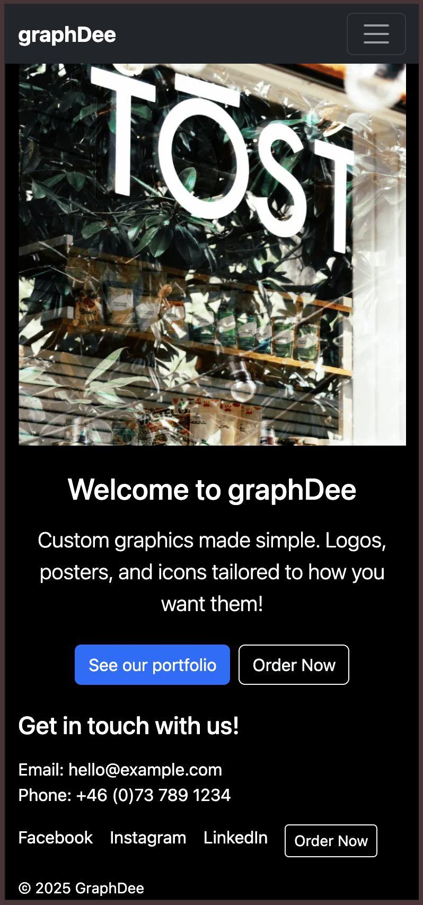

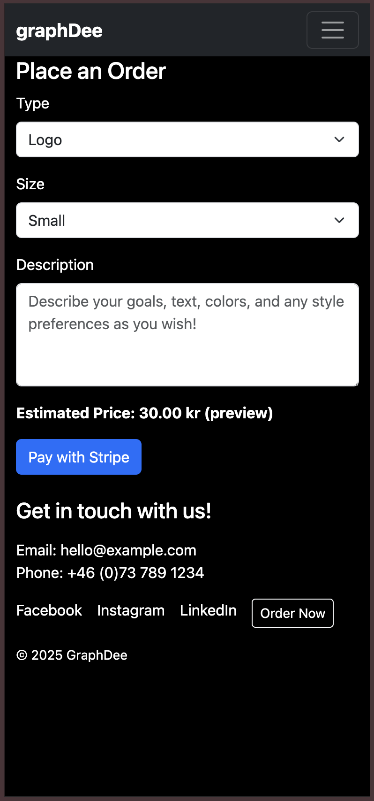
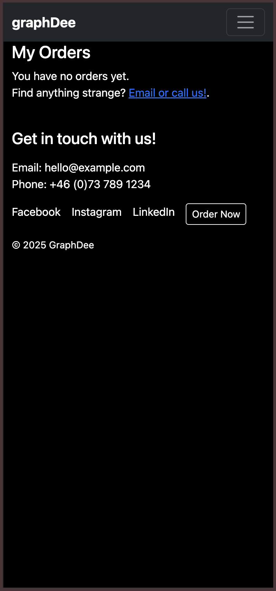

### Tablet Screenshots
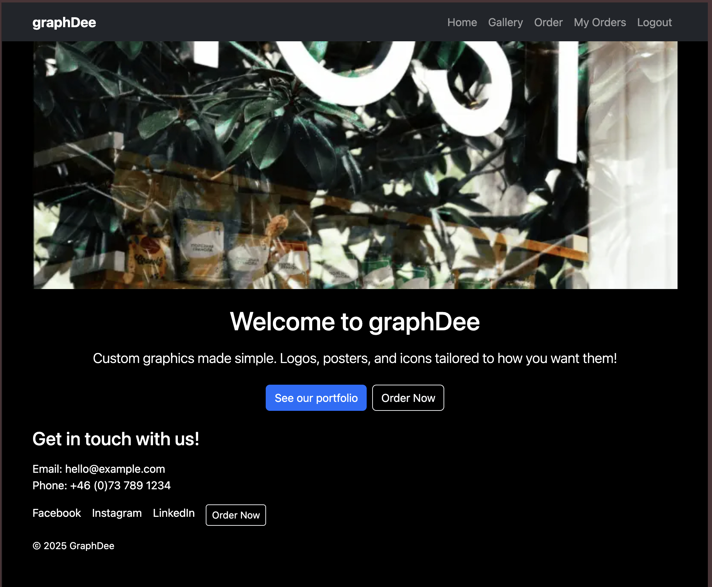
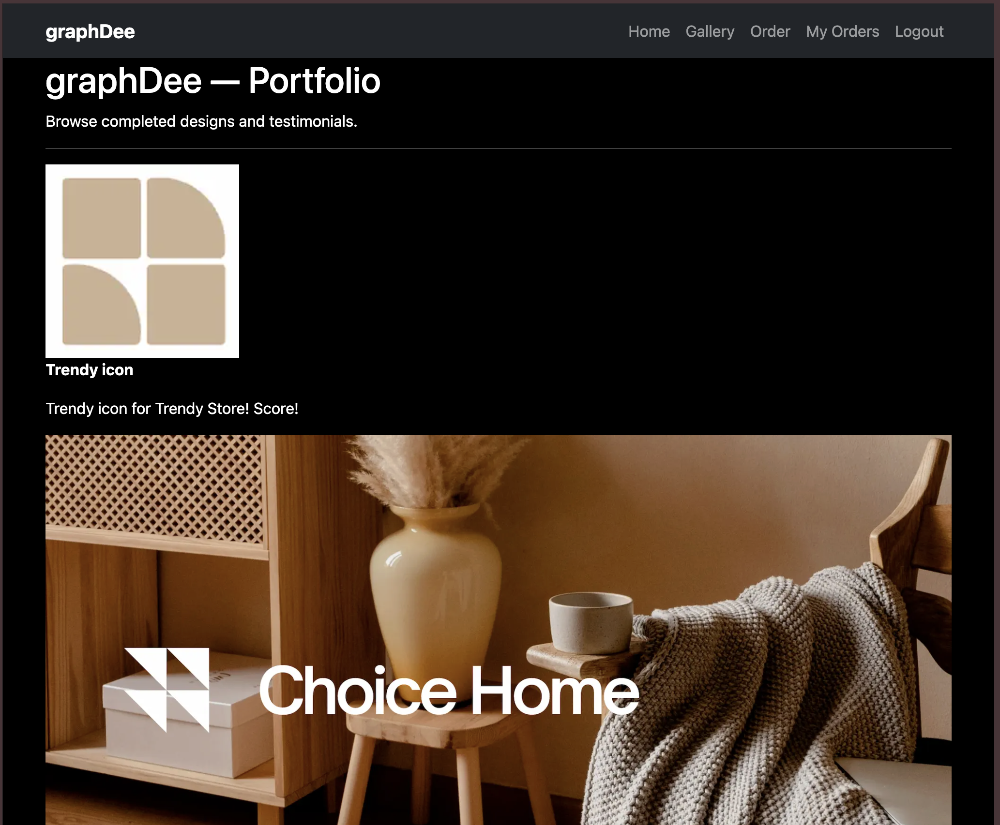
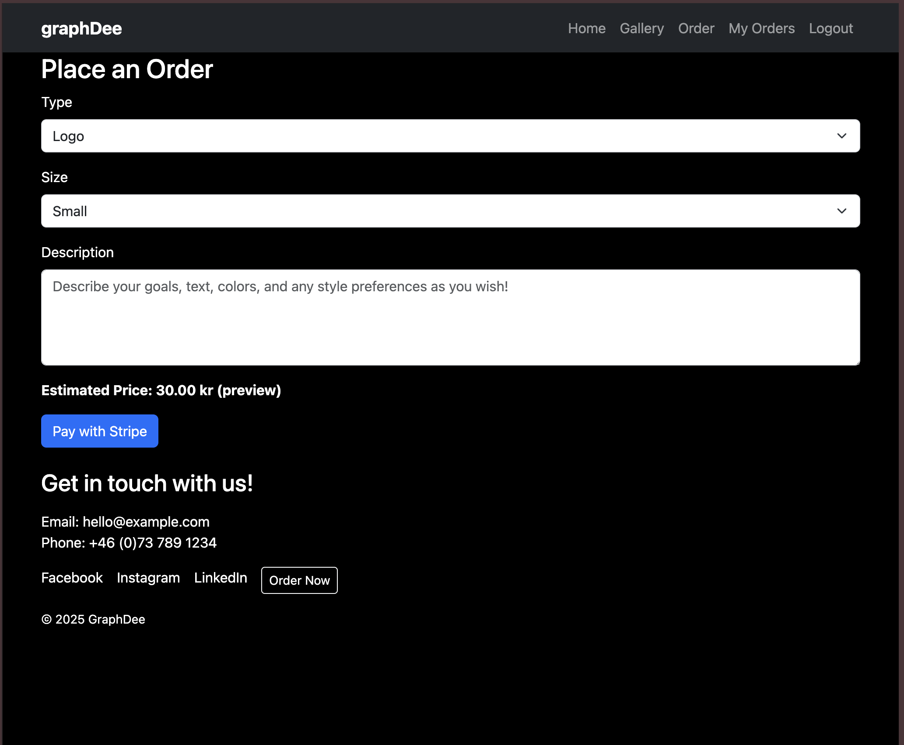
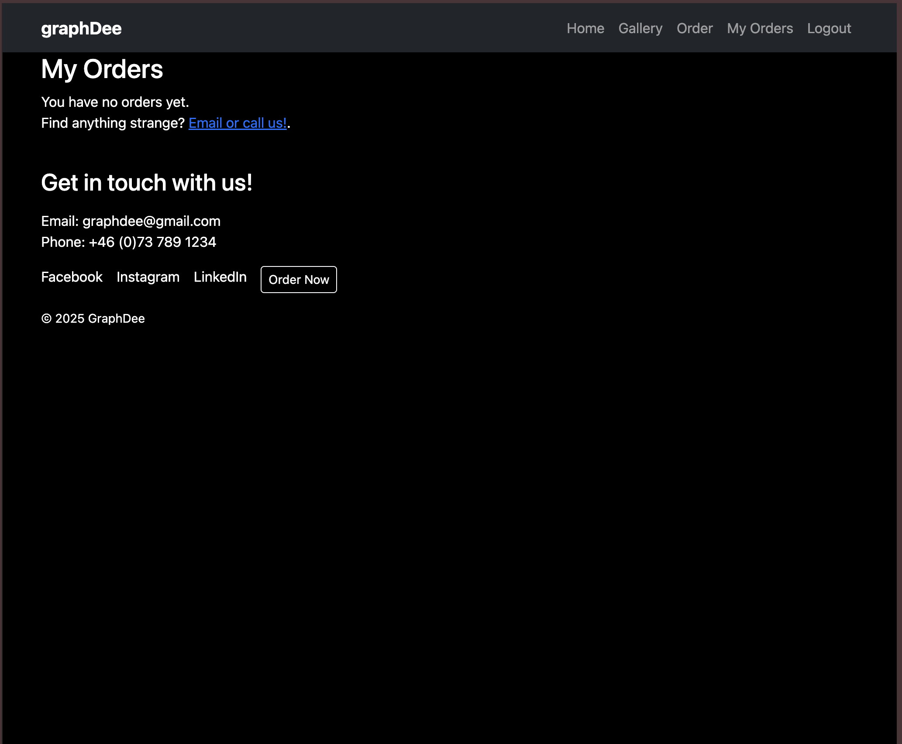

### Desktop Screenshots
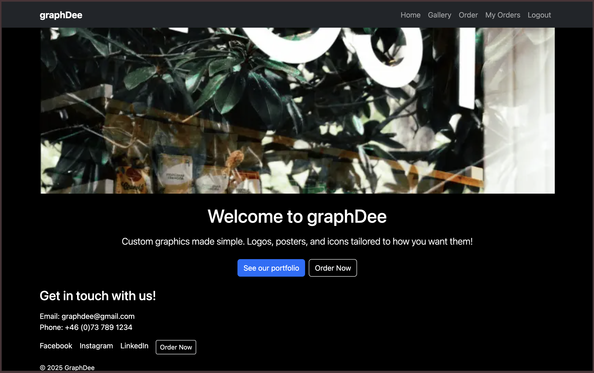
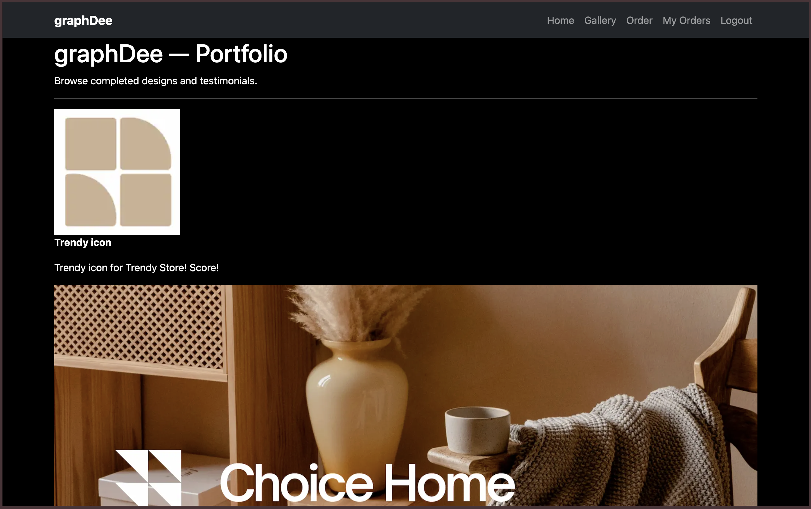
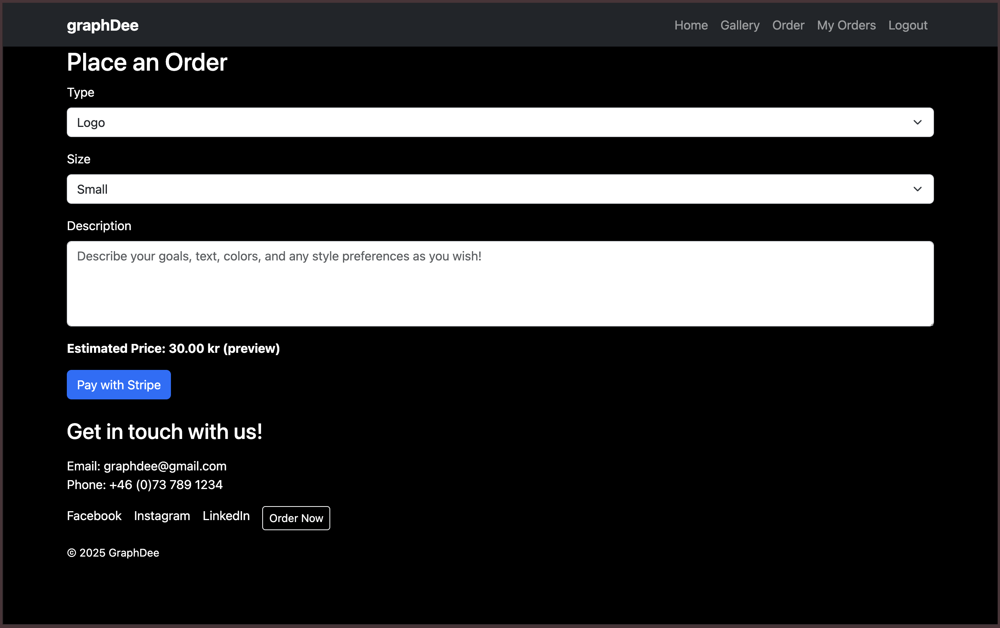
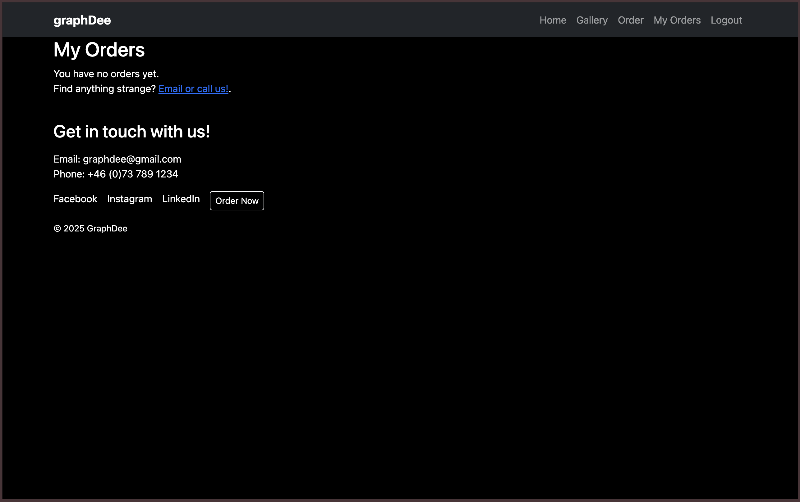

---

## Validations

### W3C Validator
All top-level rendered templates were checked using the [W3C Markup Validation Service](https://validator.w3.org/) and https://jigsaw.w3.org/css-validator/ 
Screens were validated by pasting the rendered HTML (View Source) into the validator.

**Results, among others:**

- w3 - html check initial results

- w3 - .html file had < style >

- w3 - Moved the footer styling to  style.css.

- w3 - html check subsequent results

- w3 - css check results - No errors found.

> Note: Any Django template tags were rendered in-browser before validation to avoid false positives.

### JSHint
JavaScript was validated with [JSHint](https://jshint.com/).  

**Results, among others:** 

- JSHint - Error found in price_preview.js

- JSHint - Fixed the error by adding curly braces and spaces to if return line as mentioned in the jshint finding.

### Python Linter

Validated using the Code Institute Python Linter (flake8 equivalent) across the project apps:

**Results, among others:** 

- CI Python Linter - No errors found.

---

## Lighthouse

Lighthouse audits (Performance, Accessibility, Best Practices, SEO) were run in Chrome DevTools for key pages:

**Results, among others:** 

- Lighthouse results are ok.

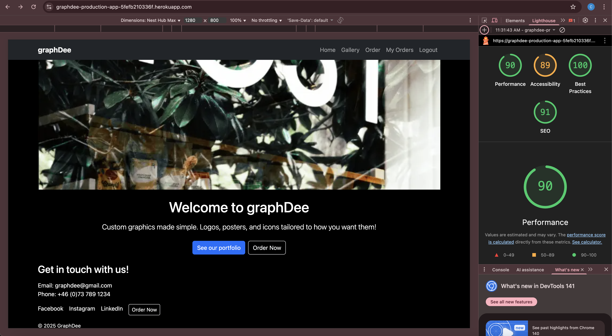

---

## Wave Webaim

Accessibility verified using the [WAVE extension](https://wave.webaim.org/).  

**Results, among others:** 

- Wave webaim contrast checker results passed.

---

## Browser Compatibility

Tested on latest stable versions:
- Chrome
- Safari (macOS)

**Results, among others:** 

Pages opened using the Safari browser:

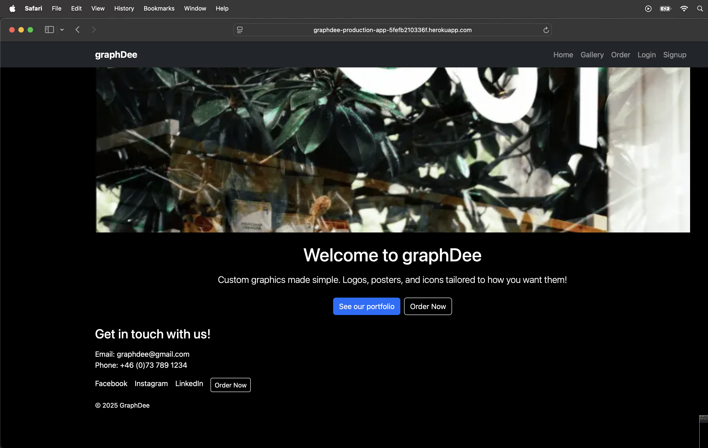

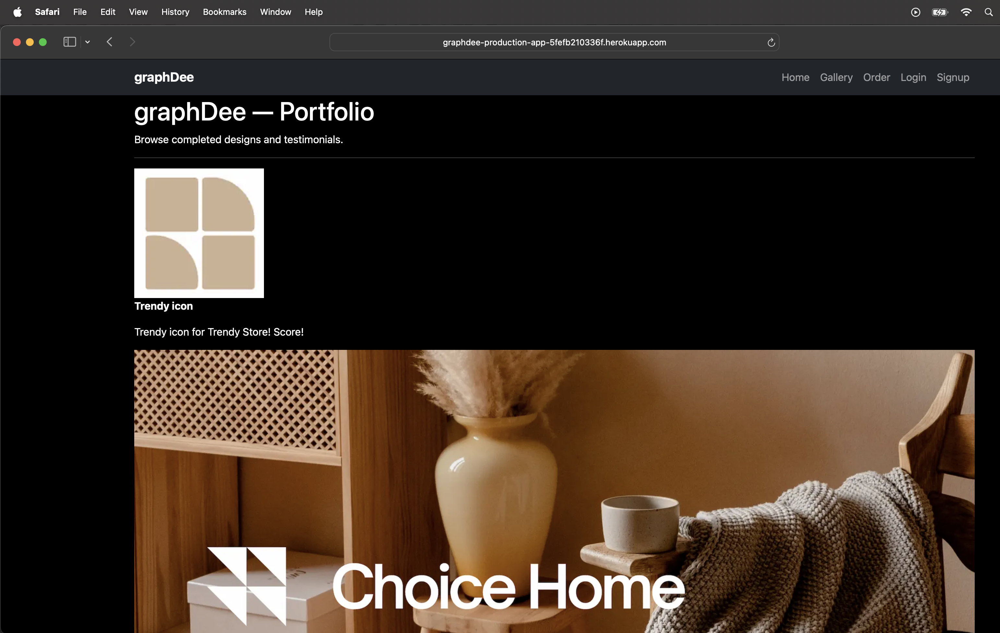

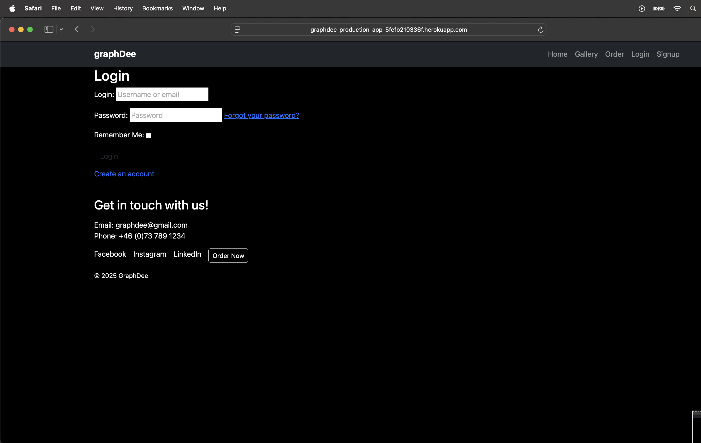

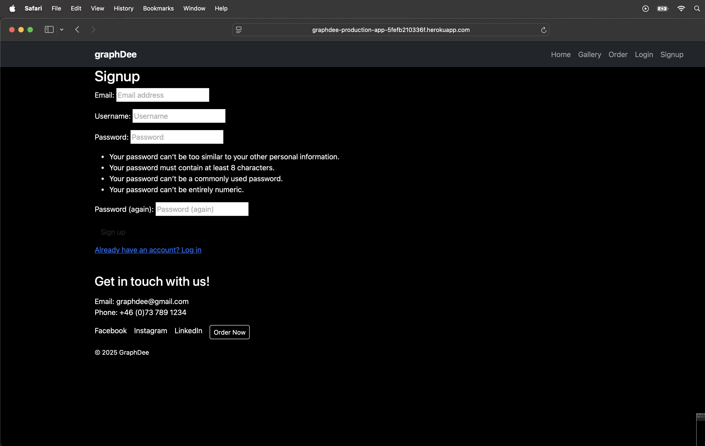

---

## Full Testing

All tests below were performed on both **local** (`http://127.0.0.1:8000`) and **production** (Heroku) where applicable. Stripe was tested with **test mode** keys and **test cards**.

### Interactive Elements

**Navbar**
| Feature | Expected Outcome | Testing Performed | Result | Pass/Fail |
| :-----: | :--------------: | :---------------: | :----: | :-------: |
| Brand/Home | Clicking brand or “Home” goes to `/`. | Clicked brand and Home. | Landed on Home. | Pass |
| Gallery | Goes to `/gallery/`. | Clicked Gallery. | Gallery displayed. | Pass |
| Order | Goes to `/orders/`. | Clicked Order. | Order form displayed. | Pass |
| My Orders (auth only) | Goes to `/orders/my/`. | Logged in, clicked link. | My Orders page displayed. | Pass |
| Login/Signup (anon only) | Goes to Allauth pages. | Clicked Login/Signup. | Pages displayed. | Pass |
| Logout (auth only) | Logs out and redirects. | Clicked Logout. | Logged out & redirected. | Pass |

**Footer**
| Feature | Expected Outcome | Testing Performed | Result | Pass/Fail |
| :-----: | :--------------: | :---------------: | :----: | :-------: |
| Email link | Opens mail client. | Clicked `mailto:`. | Mail client opened. | Pass |
| Phone link | Initiates call on mobile. | Clicked `tel:` on mobile. | Dialer opened. | Pass |
| Social links | Open in new tab. | Clicked links. | Opened in new tab. | Pass |
| Order Now button | Goes to `/orders/`. | Clicked button. | Order page displayed. | Pass |

**Home**
| Feature | Expected Outcome | Testing Performed | Result | Pass/Fail |
| :-----: | :--------------: | :---------------: | :----: | :-------: |
| “View Gallery” | Navigates to Gallery. | Clicked button. | Gallery displayed. | Pass |
| “Order Now” | Navigates to Order. | Clicked button. | Order displayed. | Pass |

**Gallery**
| Feature | Expected Outcome | Testing Performed | Result | Pass/Fail |
| :-----: | :--------------: | :---------------: | :----: | :-------: |
| Design list | Shows designs with images/testimonials. | Loaded page. | Designs rendered. | Pass |

**Order Form**
| Feature | Expected Outcome | Testing Performed | Result | Pass/Fail |
| :-----: | :--------------: | :---------------: | :----: | :-------: |
| Type/Size required | Form prevents submit when missing. | Tried empty submit. | Validation prevented. | Pass |
| Description optional | Form submits without description. | Cleared description. | Submitted. | Pass |
| JS price preview | Updates preview on change. | Changed type/size. | Preview updated (kr). | Pass |
| Stripe redirect | Sends to Stripe checkout. | Submitted with valid fields. | Redirected to Stripe. | Pass |

**Payment (Stripe test mode)**
| Feature | Expected Outcome | Testing Performed | Result | Pass/Fail |
| :-----: | :--------------: | :---------------: | :----: | :-------: |
| Valid test card | 4242… card succeeds. | Used 4242 4242 4242 4242. | Payment succeeded. | Pass |
| Cancel | Returns to Order page. | Clicked cancel on Stripe. | Back on Order. | Pass |

**Payment Success**
| Feature | Expected Outcome | Testing Performed | Result | Pass/Fail |
| :-----: | :--------------: | :---------------: | :----: | :-------: |
| Success page | Confirmation text shown. | Returned with session_id. | Page displayed. | Pass |
| “My Orders” link | Goes to `/orders/my/`. | Clicked link. | My Orders displayed. | Pass |

**My Orders**
| Feature | Expected Outcome | Testing Performed | Result | Pass/Fail |
| :-----: | :--------------: | :---------------: | :----: | :-------: |
| List orders | Shows id, type, size, description (30 chars), price (kr), paid flag, status. | Loaded page. | Details correct. | Pass |
| Paid status | Marked paid after Stripe webhook. | Triggered test webhook. | Status updated to **Paid** in production; local requires CLI listener. | Pass |

**Authentication (allauth)**
| Feature | Expected Outcome | Testing Performed | Result | Pass/Fail |
| :-----: | :--------------: | :---------------: | :----: | :-------: |
| Signup | Creates account. | Signed up test user. | Account created. | Pass |
| Login | Logs user in. | Logged in new user. | Logged in with success msg. | Pass |
| Logout | Logs user out. | Clicked logout. | Logged out. | Pass |

---

## Bugs

### Solved Bugs
| Bug | Solution |
|:----|:---------|
| `NoReverseMatch` for `payment_success` during create order. | Ensured `orders/urls.py` includes `path("success/", ...)` and used `reverse("payment_success")` after including `orders.urls` with `app_name="orders"` and namespaced menu links (``). |
| Stripe `SessionService.create() got an unexpected keyword argument 'mode'`. | Switched to `client.checkout.sessions.create({...})` payload structure compatible with `stripe==13.x`. |
| S3 static not appearing. | Added `USE_AWS=True` config, `STATICFILES_LOCATION="static"`, ran `collectstatic`, and set bucket policy to allow public read (objects). |
| Public bucket ACL advice from tutorial not available. | Used **Bucket owner enforced** with **Bucket Policy** for public reads rather than ACLs. |
| Price preview currency symbol inconsistent. | Updated `price_preview.js` to output `kr`, and server-side pricing stays authoritative. |

### Known Bugs
| Bug | Description |
|:----|:------------|
| Local webhook doesn’t auto-mark orders paid | In development, orders remain “Unpaid” unless you run the Stripe CLI listener and trigger test events; production (Heroku) updates via real endpoint + signing secret. |
| Browser autofill styles on Stripe page | Stripe-hosted page styles are Stripe defaults and may not match site theme exactly (acceptable for test mode). |

---
